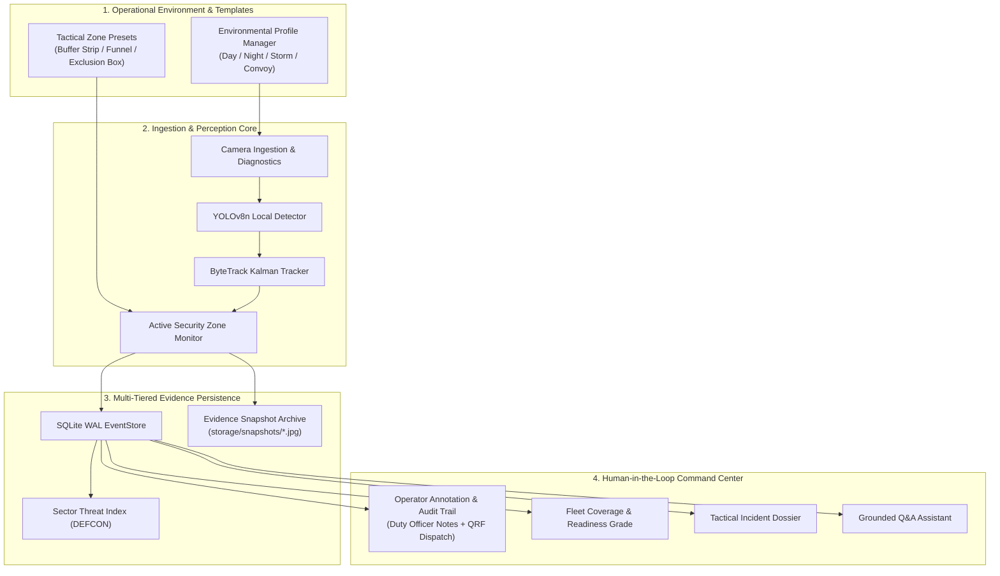

# BORDER INTELLIGENCE — TIER-A ARCHITECTURE DOCUMENTATION

**Project**: Border Intelligence — AI-Powered Persistent Border Surveillance & Incident Intelligence Platform  
**SIH Problem Statement**: PS SIH26187 ("AI-Based Intelligent Video Analytics Platform for Border Surveillance using existing CCTV Infrastructure")  

---

## 1. System Architecture Diagram



---

## 2. Tier-A REST API Schemas & Contracts

### 2.1 Operator Incident Annotations
- **`POST /api/incidents/{incident_id}/notes`**
```json
{
  "operator_callsign": "Captain Rao",
  "note": "Perimeter breach verified via PTZ thermal confirmation.",
  "disposition": "VERIFIED_BREACH"
}
```
- **`GET /api/incidents/{incident_id}/notes`**
```json
{
  "incident_id": "INC-20260824-001",
  "count": 1,
  "annotations": [
    {
      "annotation_id": "67f1b212-32a1-4328-bcde-90df1133ab12",
      "incident_id": "INC-20260824-001",
      "operator_callsign": "Captain Rao",
      "note": "Perimeter breach verified via PTZ thermal confirmation.",
      "disposition": "VERIFIED_BREACH",
      "timestamp": "2026-08-24T00:10:00Z"
    }
  ]
}
```

### 2.2 Security Zone Tactical Templates
- **`GET /api/zones/templates`**: Lists standard perimeter defense templates.
- **`POST /api/zones/apply-template`**:
```json
{
  "template_id": "GATE_ACCESS_FUNNEL",
  "zone_id_suffix": "SECTOR_NORTH",
  "custom_name": "North Gate Approach Corridor"
}
```

### 2.3 Fleet Surveillance Coverage & Readiness Report
- **`GET /api/system/coverage-report`**
```json
{
  "report_timestamp": "2026-08-24T00:10:00Z",
  "total_cameras_registered": 4,
  "active_cameras_online": 4,
  "sector_coverage_percentage": 100.0,
  "surveillance_readiness_grade": "GRADE_A_COMBAT_READY",
  "strategic_assessment": "Full sector coverage operational across all primary and secondary CCTV checkpoints.",
  "total_events_logged": 1420,
  "total_alerts_logged": 34
}
```

### 2.4 Environmental Operation Profiles
- **`GET /api/system/profiles`**: Returns active profile and available presets.
- **`POST /api/system/profiles/apply`**:
```json
{
  "profile_id": "HIGH_SENSITIVITY_NIGHT"
}
```

### 2.5 Visual Evidence Snapshots
- **`GET /api/evidence/snapshots/{incident_id}`**:
```json
{
  "incident_id": "INC-20260824-001",
  "count": 1,
  "snapshots": [
    {
      "snapshot_id": "SNAP_INC-20260824-001_45_1724458200",
      "incident_id": "INC-20260824-001",
      "camera_id": "CAM-01",
      "frame_number": 45,
      "trigger_reason": "CRITICAL_LINE_CROSS",
      "file_path": "./storage/snapshots/SNAP_INC-20260824-001_45_1724458200.jpg",
      "file_uri": "/api/evidence/snapshots/file/SNAP_INC-20260824-001_45_1724458200.jpg",
      "timestamp": "2026-08-24T00:10:00Z"
    }
  ]
}
```
