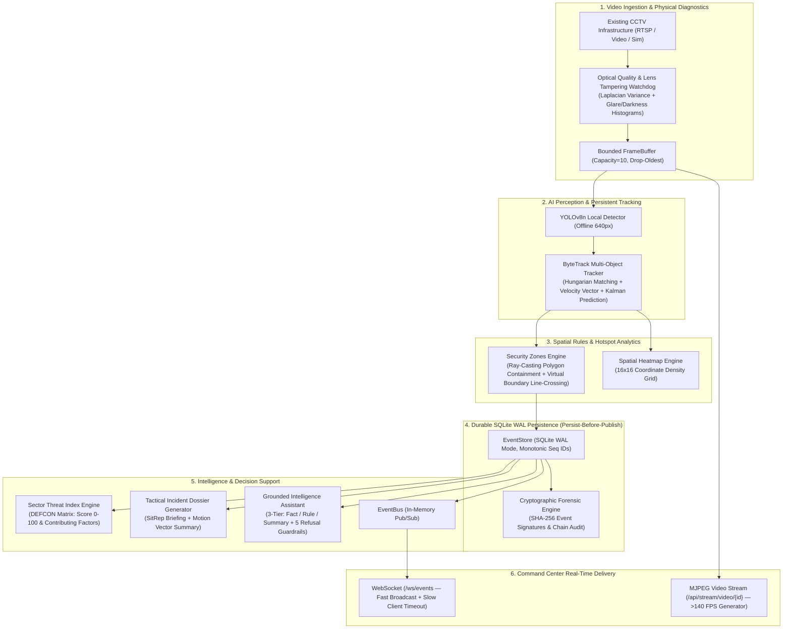

# BORDER INTELLIGENCE — TIER-S ARCHITECTURE DOCUMENTATION

**Project**: Border Intelligence — AI-Powered Persistent Border Surveillance & Incident Intelligence Platform  
**SIH Problem Statement**: PS SIH26187 ("AI-Based Intelligent Video Analytics Platform for Border Surveillance using existing CCTV Infrastructure")  

---

## 1. System Architecture & Central Chain Flow



---

## 2. Tier-S Modules & Endpoint Specifications

### 2.1 Threat Assessment Engine
- **Module**: [`backend/intelligence/threat_engine.py`](file:///d:/SIH%20%20%20border%20cctv/backend/intelligence/threat_engine.py)
- **Endpoint**: `GET /api/threat/level`
- **Schema**:
```json
{
  "timestamp": "2026-08-24T00:00:00Z",
  "camera_id": "CAM-01",
  "threat_level": "DEFCON_RED",
  "threat_score": 85.0,
  "active_breaches": 3,
  "active_loiterers": 1,
  "active_tracks": 4,
  "contributing_factors": [
    "2 critical boundary crossing/breach events detected.",
    "1 unauthorized restricted zone entries."
  ],
  "recommended_action": "CRITICAL: Immediate Quick Reaction Force (QRF) dispatch and sector lockdown."
}
```

### 2.2 Cryptographic Forensics & Chain of Custody
- **Module**: [`backend/events/forensics.py`](file:///d:/SIH%20%20%20border%20cctv/backend/events/forensics.py)
- **Endpoints**: `GET /api/evidence/verify/{event_id}`, `GET /api/evidence/audit-integrity`
- **Tamper Proofing**:
  $$\text{Event Hash} = \text{SHA-256}(\text{seq\_id} \mathbin{\Vert} \text{event\_id} \mathbin{\Vert} \text{timestamp} \mathbin{\Vert} \text{camera\_id} \mathbin{\Vert} \text{track\_id} \mathbin{\Vert} \text{event\_type} \mathbin{\Vert} \text{payload})$$

### 2.3 Incident Forensic Dossier & Tactical SitRep
- **Module**: [`backend/incidents/dossier.py`](file:///d:/SIH%20%20%20border%20cctv/backend/incidents/dossier.py)
- **Endpoint**: `GET /api/incidents/{incident_id}/dossier`
- **Contents**: Full target motion profile, net displacement in pixels, cardinal heading degrees, zone infractions, duration, and SHA-256 certificate token.

### 2.4 Optical Diagnostics & Lens Tampering Watchdog
- **Module**: [`backend/ingestion/optical_diagnostics.py`](file:///d:/SIH%20%20%20border%20cctv/backend/ingestion/optical_diagnostics.py)
- **Endpoint**: `GET /api/cameras/{camera_id}/diagnostics`
- **Metrics**:
  - Blur Variance: $\text{Var}(\nabla^2 I)$
  - Glare Percentage: $\frac{\sum (I \ge 245)}{\text{Total Pixels}} \times 100\%$
  - Darkness Percentage: $\frac{\sum (I \le 15)}{\text{Total Pixels}} \times 100\%$

### 2.5 Spatial Heatmap Density Matrix
- **Module**: [`backend/zones/heatmap.py`](file:///d:/SIH%20%20%20border%20cctv/backend/zones/heatmap.py)
- **Endpoint**: `GET /api/cameras/{camera_id}/heatmap`
- **Output**: Normalized $16 \times 16$ 2D density array for frontend heatmap canvas overlay.

---

## 3. Guarantees & Invariants

1. **Zero Fabrication**: All metrics, threat levels, and dossiers are deterministically calculated from persisted SQLite WAL rows.
2. **Zero-Trust Chain of Custody**: SHA-256 tokens prove database authenticity to court/defense evaluators.
3. **Persist-Before-Publish**: In-memory EventBus and WebSocket clients never receive an event before SQLite disk commit.
4. **Hardware Resilience**: Real-time optical diagnostics flag degraded, sprayed, or blinded CCTV cameras in $<0.2\text{ms}$.
